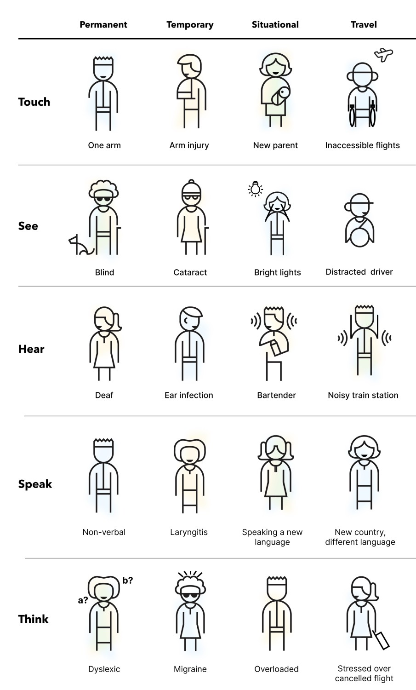

**L'accessibilité web**, c'est rendre votre site utilisable par tout le monde, y compris les personnes en situation de handicap.

Pensez au cinéma : le sous-titrage a été conçu pour les personnes sourdes ou malentendantes, mais il profite finalement à tous (dans les bars bruyants, pour apprendre une langue, quand on ne peut pas mettre le son...).

## Pourquoi c'est important ?

### 1. Pourquoi maintenant ?

Intégrer l'accessibilité dès le début coûte peu. La corriger plus tard coûte cher. C'est aussi souvent une obligation légale.

### 2. L'accessibilité concerne tout le monde

L'accessibilité n'est pas "eux vs nous". Elle touche tout le monde, à différents moments :

**Handicaps permanents**
- Cécité, surdité, mobilité réduite
- Troubles cognitifs (dyslexie, autisme)
- 15% de la population mondiale (OMS)

**Handicaps temporaires**
- Bras cassé, infection oculaire
- Commotion cérébrale, fatigue intense

**Situations**
- Tenir un bébé (une main occupée)
- Regarder en plein soleil (contraste faible)
- Environnement bruyant (pas de son)
- Connexion lente (chargement difficile)



:::note[À votre tour]
**Réfléchissez :** Pensez à une situation récente où le design d'une application vous a empêché d'accomplir une action alors que vous étiez en situation de handicap temporaire.

Exemples :
- Impossible de lire un SMS en marchant en plein soleil (contraste trop faible)
- Impossible de naviguer avec une main occupée (pas de navigation au clavier/swipe)
- Vidéo incompréhensible dans le train bondé (pas de sous-titres)
- Site inutilisable avec connexion lente (images lourdes, pas de fallback texte)

Ces frustrations que vous avez vécues ? C'est exactement ce que vivent en permanence les personnes en situation de handicap face à un site inaccessible.
:::


### 3. Ça profite à tout le monde

Comme au cinéma :
- Le **contraste élevé** aide quand on regarde en plein soleil
- Les **sous-titres** aident quand on regarde sans son
- Une **structure narrative claire** aide à suivre l'histoire

Sur le web :
- Le **contrôle vocal** (développé pour handicaps moteurs) → utilisé par tous en voiture
- L'**auto-complétion** (développée pour troubles cognitifs) → accélère la saisie pour tous
- Les **sous-titres** (développés pour sourds) → utilisés dans 85% des vidéos sur mobile (son coupé)
- Des **textes de liens clairs** → aident tout le monde à comprendre
- Une **bonne hiérarchie de titres** → aide à scanner rapidement

### 4. Meilleur référencement (SEO)

Google "lit" votre site un peu comme un lecteur d'écran. **Un site accessible = un site mieux référencé**.

## Le parallèle avec le cinéma

En tant qu'étudiants en cinéma, vous savez que :

| Au cinéma | Sur le web |
|-----------|------------|
| **Un bon montage** guide le spectateur | **Une bonne structure HTML** guide l'utilisateur |
| **Le sound design** donne du contexte | **Les textes alternatifs** donnent du contexte |
| **La typographie des sous-titres** doit être lisible | **Le contraste texte/fond** doit être suffisant |
| **Un bon scénario** a une structure claire | **La hiérarchie des titres** structure le contenu |

:::tip[Pensez "universel"]
Comme Wong Kar-wai utilise la couleur et la musique pour créer l'émotion au-delà des dialogues, votre site doit communiquer de multiples façons : structure, texte, images, navigation...
:::

### En pratique : 5 principes de base

Pour rendre votre site d'histoire accessible :

1. ✅ **Textes alternatifs** (`alt`) sur toutes les images importantes
2. ✅ **Hiérarchie de titres** logique et cohérente (h1 → h2 → h3)
3. ✅ **Liens explicites** ("Lire le chapitre 2" plutôt que "cliquer ici")
4. ✅ **Contrastes suffisants** entre texte et fond
5. ✅ **Navigation au clavier** possible (touche Tab)

:::tip[Point de départ, pas liste de contrôle]
Ces 5 principes sont un **point de départ**, pas une fin en soi. L'accessibilité est une pratique continue, pas une case à cocher. Testez avec de vrais utilisateurs.
:::

Dans les prochaines sections, nous allons voir concrètement comment appliquer ces principes.

## Questions fréquentes

**"On n'a pas d'utilisateurs handicapés"**  
Si votre site est inaccessible, ils ne peuvent pas l'utiliser. Rendez-le accessible, ils viendront.

**"C'est un cas rare"**  
1 personne sur 6 dans le monde vit avec un handicap. Et l'accessibilité aide tout le monde (voir ci-dessus).

**"On ajoutera ça plus tard"**  
Mauvaise idée. Corriger plus tard coûte beaucoup plus cher que de bien faire dès le début.

---

## Pourquoi la sémantique HTML ?

La sémantique HTML consiste à utiliser les bonnes balises pour le bon contenu. C'est important pour :

1. **Les moteurs de recherche** : ils comprennent mieux votre contenu
2. **L'accessibilité** : les lecteurs d'écran peuvent naviguer efficacement
3. **La maintenance** : votre code est plus lisible et compréhensible
4. **Le SEO (Search engine optimization)** : votre site est mieux référencé

### Mauvais exemple (non sémantique)

```html
<div class="header">
  <div class="nav">
    <div class="nav-item">Accueil</div>
    <div class="nav-item">Histoire</div>
  </div>
</div>

<div class="content">
  <div class="article">
    <div class="title">Mon histoire</div>
    <div class="text">Il était une fois...</div>
  </div>
</div>

<div class="footer">
  <div>© 2025</div>
</div>
```

### Bon exemple (sémantique)

```html
<header>
  <nav>
    <a href="/">Accueil</a>
    <a href="/histoire">Histoire</a>
  </nav>
</header>

<main>
  <article>
    <h1>Mon histoire</h1>
    <p>Il était une fois...</p>
  </article>
</main>

<footer>
  <p>&copy; 2025</p>
</footer>
```

:::tip[Pourquoi c'est mieux ?]
Avec les balises sémantiques, un lecteur d'écran peut dire à l'utilisateur : "Vous êtes maintenant dans la navigation principale" ou "Voici l'article principal". Avec des `<div>`, tout est indifférencié.
:::
