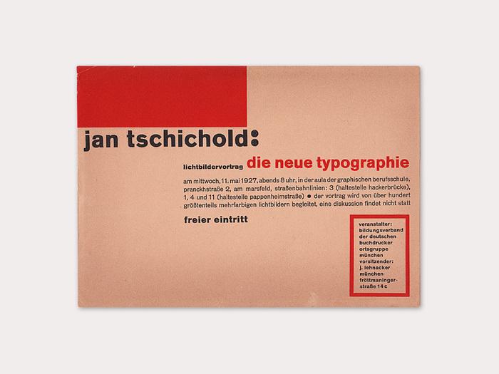

Le Bauhaus (1919-1933) a révolutionné le design en utilisant des grilles modulaires pour organiser l'espace. CSS Grid fonctionne exactement de cette manière : des colonnes et lignes sur lesquelles placer précisément chaque élément.

## Objectif

Reproduire une affiche Bauhaus en plaçant manuellement des éléments sur une grille CSS.

**Ce que vous allez pratiquer** :
- Placement précis avec `grid-column` et `grid-row`
- Composition asymétrique
- Superposition d'éléments

**Durée estimée** : 30-45 minutes

---

## Référence : Die Neue Typographie (1927)

Affiche de Jan Tschichold pour une conférence sur la nouvelle typographie.

**Structure de la grille** : 6 colonnes × 8 lignes

**Éléments à placer** :
- Titre noir en haut à gauche
- Date rouge en haut à droite
- Blocs de texte de tailles variées
- Rectangle jaune décoratif
- Texte vertical "FREIER EINTRITT"
- Rectangles colorés



---

## À vous de jouer

Le HTML est fourni. Votre tâche : placer chaque élément sur la grille en utilisant `grid-column` et `grid-row`.

**Point de départ sur CodePen** (à venir)

:::tip[Rappel]
```css
.element {
  grid-column: 1 / 4; /* De la colonne 1 à 4 */
  grid-row: 2 / 3;    /* De la ligne 2 à 3 */
}
```
:::

### Indices

<details>
<summary>💡 Comment commencer ?</summary>

1. **Identifiez chaque élément** : titre, sous-titre, date, description, etc.
2. **Observez la référence** : où est placé chaque bloc ?
3. **Comptez les colonnes/lignes** : grille 6×8
4. **Placez un élément à la fois** et vérifiez le résultat

La grille de visualisation (lignes grises) vous aide à voir les colonnes et lignes.
</details>

<details>
<summary>💡 Le titre ne se place pas ?</summary>

Le titre occupe environ 4 colonnes et 1 ligne. Essayez :

```css
.title {
  grid-column: 1 / 5;
  grid-row: 1 / 2;
}
```
</details>

<details>
<summary>💡 Comment faire le texte vertical ?</summary>

Le texte vertical utilise `writing-mode: vertical-rl;` (déjà dans le CSS). Il vous suffit de le placer sur la grille :

```css
.vertical-text {
  grid-column: 6 / 7;
  grid-row: 2 / 6;
}
```
</details>

---

## Solution

<details>
<summary>Voir la solution complète</summary>

**Solution sur CodePen** (à venir)

### Code CSS des placements

```css
.title {
  grid-column: 1 / 5;
  grid-row: 1 / 2;
}

.subtitle {
  grid-column: 1 / 6;
  grid-row: 2 / 3;
}

.date {
  grid-column: 5 / 7;
  grid-row: 1 / 2;
}

.description {
  grid-column: 1 / 5;
  grid-row: 3 / 5;
}

.location {
  grid-column: 1 / 4;
  grid-row: 5 / 6;
}

.info {
  grid-column: 1 / 5;
  grid-row: 6 / 7;
}

.organizer {
  grid-column: 1 / 5;
  grid-row: 7 / 9;
}

.accent-block {
  grid-column: 5 / 6;
  grid-row: 3 / 5;
}

.vertical-text {
  grid-column: 6 / 7;
  grid-row: 2 / 6;
}
```

### Points clés

**Asymétrie** : Les éléments ne sont pas tous de la même taille. C'est voulu.

**Superposition** : Certains éléments se chevauchent visuellement grâce à des placements adjacents.

**Espaces vides** : Des cellules restent vides. Ça fait partie de la composition.

</details>

---

## 🎯 Bonus : Ajouter de la rotation

Une fois la composition de base réussie, ajoutez un élément avec rotation.

### Exemple

Ajoutez ce HTML :

```html
<div class="bonus-rotated">ABENDS 8 UHR</div>
<div class="accent-small"></div>
```

Et ce CSS :

```css
.bonus-rotated {
  background: black;
  color: white;
  padding: 0.5rem;
  font-size: 0.7rem;
  font-weight: bold;
  display: flex;
  align-items: center;
  justify-content: center;
  grid-column: 5 / 7;
  grid-row: 6 / 7;
  transform: rotate(-90deg); /* Rotation de 90° dans le sens horaire */
}

.accent-small {
  background: #E30613;
  grid-column: 5 / 7;
  grid-row: 7 / 9;
}
```

### Comment combiner Grid + Transform

`transform` n'affecte pas la position de la grille. L'élément est d'abord placé sur la grille, **puis** tourné.

**Ordre d'application** :
1. Placement avec `grid-column` et `grid-row`
2. Rotation avec `transform: rotate()`

Vous pouvez combiner plusieurs transformations :

```css
.element {
  transform: rotate(-90deg) scale(1.1) translateX(10px);
}
```

---

## Ce que vous avez appris

- **Placement manuel** : `grid-column` et `grid-row` permettent un contrôle précis
- **Composition asymétrique** : pas besoin que tout soit aligné parfaitement
- **Grilles dans le design** : le Bauhaus utilisait déjà des systèmes modulaires
- **Combinaison Grid + Transform** : placement d'abord, rotation ensuite

---

## Aller plus loin

Essayez de créer votre propre composition Bauhaus :
- Changez les couleurs (bleu, jaune, rouge, noir)
- Modifiez la grille (5×10, 7×6, etc.)
- Ajoutez des rotations subtiles
- Créez des formes géométriques avec `clip-path`

**Inspiration** : [Jen Simmons Labs - Study of Flexibility](https://labs.jensimmons.com/)
