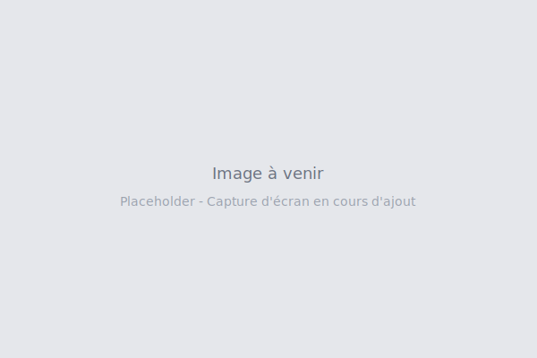

## Vue d'ensemble

Cette catégorie explore les performances, spectacles et installations où l'interaction collective et la participation synchronisée transforment le public en co-créateur de l'expérience.

**Question centrale :** Comment le public devient-il partie intégrante de l'œuvre ?

**Concepts clés :** Interaction collective, spectacle augmenté, participation synchronisée, contrôle distribué

---

## Spectacles tech-comédie

### Robot Chef - Foxdog Studios

**Type :** Spectacle de cuisine interactive AR  
**Créateurs :** Lloyd et Peter (Foxdog Studios)  
**Année :** 2019-présent

**💡 Ce qui fonctionne :** Cuisine réelle équipée de moteurs, aimants et mécanismes robotiques. Le public se connecte au WiFi local, dessine un personnage en réalité augmentée et contrôle l'équipement via joystick sur smartphone. Résultat : cuisiner collectivement via avatars AR. Canon à saucisses, tracteur en bois déplaçant des poêles, allumage par taser.

**🎯 Pourquoi c'est inspirant :** Transforme un spectacle passif en chaos contrôlé collaboratif. Chaque spectateur a un impact direct sur ce qui se passe sur scène. L'absurdité technique (canon à saucisses) sert l'humour. Anciens consultants IT qui détournent leurs compétences pour la comédie.

**📚 Pertinent pour :** RTMF1M (Territoires 2 + 4), MM3B (participation collective)

**🔗 Statut :** [Fonctionnel](https://foxdogstudios.com/)

---

### Robo Bingo - Foxdog Studios

**Type :** Bingo augmenté interactif  
**Créateurs :** Lloyd et Peter (Foxdog Studios)  
**Année :** 2022-présent

**💡 Ce qui fonctionne :** Bingo détourné où les joueurs utilisent leur smartphone au lieu de cartons physiques. Commence comme du bingo classique mais évolue vers des mini-jeux absurdes : aider le robot bingo à capturer des grenouilles, naviguer dans des labyrinthes, etc. L'interface mobile devient progressivement plus expérimentale.

**🎯 Pourquoi c'est inspirant :** Subvertit un format rigide (bingo) en spectacle interactif évolutif. Démontre qu'on peut partir d'une mécanique familière pour amener le public vers des interactions surprenantes. Auto-décrit comme "bingo pour introvertis".

**📚 Pertinent pour :** RTMF1M (Territoires 2 + 4), MM3B (jeux détournés)

**🔗 Statut :** [Fonctionnel](https://foxdogstudios.com/)

---

## Installations participatives urbaines

### Can You See Me Now? - Blast Theory

**Type :** Jeu urbain en réalité mixte  
**Créateurs :** Blast Theory  
**Année :** 2001

**💡 Ce qui fonctionne :** Jeu de poursuite où des coureurs physiques dans la ville cherchent des joueurs en ligne sur une carte virtuelle. GPS synchronise les deux espaces. Les joueurs online se déplacent virtuellement, les coureurs physiquement. Quand un coureur attrape un joueur virtuel, photo + capture.

**🎯 Pourquoi c'est inspirant :** Pionnier de la réalité mixte avant que ce soit un buzzword. Efface la frontière entre espace physique et virtuel. L'interaction devient une chasse collaborative/compétitive dans deux espaces simultanés.

**📚 Pertinent pour :** RTMF1M (Territoires 1 + 4), MM3B (narration spatiale)

**🔗 Statut :** [Archivé - documentation disponible](https://www.blasttheory.co.uk/projects/can-you-see-me-now/)

---

### I'd Hide You - Blast Theory

**Type :** Expérience narrative mobile géolocalisée  
**Créateurs :** Blast Theory  
**Année :** 2012

**💡 Ce qui fonctionne :** Fiction interactive mobile qui utilise la géolocalisation pour raconter l'histoire d'une fuite à travers la ville. Le joueur marche physiquement pendant que l'histoire se déroule via audio et notifications. L'environnement réel devient le décor narratif.

**🎯 Pourquoi c'est inspirant :** Transforme la marche urbaine banale en narration immersive. La ville devient personnage. Utilise intelligemment les contraintes mobiles (pas toujours de réseau, marche lente) comme éléments narratifs.

**📚 Pertinent pour :** RTMF1M (Territoires 1 + 3), MM3B (narration géolocalisée)

**🔗 Statut :** [Application disponible](https://www.blasttheory.co.uk/projects/id-hide-you/)

---

### Karen - Blast Theory

**Type :** Performance téléphonique personnalisée  
**Créateurs :** Blast Theory  
**Année :** 2015

**💡 Ce qui fonctionne :** Vous recevez des appels téléphoniques planifiés d'une actrice (Karen) sur plusieurs semaines. Conversations scriptées mais réactives. Progressivement, la relation évolue et Karen vous demande des faveurs de plus en plus étranges. Exploration de la confiance et de la manipulation.

**🎯 Pourquoi c'est inspirant :** Transforme le téléphone en medium narratif intime. L'étalement temporel crée une vraie relation. Questionne jusqu'où on va s'engager dans une fiction qui envahit notre quotidien.

**📚 Pertinent pour :** RTMF1M (Territoire 3), MM3B (narration temporelle distribuée)

**🔗 Statut :** [Archivé - documentation disponible](https://www.blasttheory.co.uk/projects/karen/)

---

## Installations sonores collectives

### Dialtones (A Telesymphony) - Golan Levin

**Type :** Concert de téléphones portables  
**Créateurs :** Golan Levin  
**Année :** 2001

**💡 Ce qui fonctionne :** Concert où les téléphones du public deviennent les instruments. Système appelle les téléphones dans un ordre chorégraphié pour créer une symphonie de sonneries. Le public est assis par zone selon leur numéro pour créer une spatialisation sonore.

**🎯 Pourquoi c'est inspirant :** Pionnier de l'utilisation créative des téléphones mobiles. Transforme une nuisance (sonneries en concert) en l'œuvre elle-même. Le public devient orchestre malgré lui.

**📚 Pertinent pour :** RTMF1M (Territoire 5), MM3B (détournement créatif)

**🔗 Statut :** [Documentation disponible](http://www.flong.com/archive/projects/telesymphony/)

---

### In C - Terry Riley (version participative)

**Type :** Performance musicale minimaliste participative  
**Créateurs :** Terry Riley (1964), multiples implémentations web  
**Année :** Versions web 2010s

**💡 Ce qui fonctionne :** Composition minimaliste où chaque musicien joue 53 phrases musicales courtes dans l'ordre mais à son propre rythme. Versions web permettent à chacun de participer via navigateur, créant une performance collective synchronisée mais non dirigée.

**🎯 Pourquoi c'est inspirant :** Démontre que l'harmonie peut émerger du chaos contrôlé. Chaque participant a de l'autonomie mais le système crée de la cohérence. Modèle intéressant d'orchestration distribuée.

**📚 Pertinent pour :** RTMF1M (Territoire 5), MM3B (création collective)

**🔗 Statut :** [Multiples implémentations web disponibles]

---

## Installations visuelles participatives

### Audience - Random International

**Type :** Installation miroir collectif  
**Créateurs :** Random International  
**Année :** 2008

**💡 Ce qui fonctionne :** Mur de miroirs motorisés qui suivent les visiteurs. Chaque miroir traque un visiteur spécifique, créant une chorégraphie mécanique collective. Plus il y a de monde, plus le mouvement devient complexe et hypnotique.

**🎯 Pourquoi c'est inspirant :** Transforme la surveillance en ballet mécanique. Chaque visiteur influence le système mais le résultat global est imprévisible. Métaphore élégante de l'attention collective.

**📚 Pertinent pour :** RTMF1M (Territoire 4), MM3B (installations interactives)

**🔗 Statut :** [Documentation disponible](https://www.randominternational.com/audience)

---

### Rain Room - Random International

**Type :** Installation immersive interactive  
**Créateurs :** Random International  
**Année :** 2012

**💡 Ce qui fonctionne :** Salle où il pleut en continu, sauf là où vous vous tenez. Capteurs détectent la présence et arrêtent la pluie localement. Marchent sous la pluie sans se mouiller. Quand plusieurs personnes sont présentes, elles créent des zones sèches qui interagissent.

**🎯 Pourquoi c'est inspirant :** Installation spectaculaire qui transforme l'environnement en fonction de la présence humaine. Succès viral international (files d'attente de 4h au MoMA). Démontre la puissance d'une interaction simple mais poétique.

**📚 Pertinent pour :** RTMF1M (Territoires 1 + 4), MM3B (installations monumentales)

**🔗 Statut :** [Installation itinérante](https://www.randominternational.com/rain-room)

---

## Ressources complémentaires

### Concepts clés

- **Orchestration distribuée** : Chaque participant a de l'autonomie mais le système crée de la cohérence
- **Chaos contrôlé** : Cadre structuré qui permet l'improvisation collective
- **Participation synchronisée** : Coordination en temps réel de multiples actions
- **Émergence collective** : Le résultat global émerge des actions individuelles
- **Performance augmentée** : Spectacle traditionnel enrichi par la technologie

### Artistes et collectifs à suivre

- **Blast Theory** : Pionniers de la performance interactive urbaine et mobile
- **Random International** : Installations monumentales participatives
- **Foxdog Studios** : Tech-comédie participative
- **Golan Levin** : Performances audiovisuelles interactives
- **United Visual Artists (UVA)** : Installations lumineuses interactives

### Festivals et événements

- **Ars Electronica** (Linz) : Festival d'art numérique et performances
- **Sonar+D** (Barcelone) : Musique, créativité et technologie
- **STRP Festival** (Eindhoven) : Art, musique et technologie
- **Scopitone** (Nantes) : Cultures électroniques

### Cours associés

- **RTMF1M** : Ces œuvres correspondent aux Territoires 2 et 4
- **MM3B** : Exemples de participation collective et interactions synchronisées

---

[← Retour à la galerie](/ressources/galerie/)
